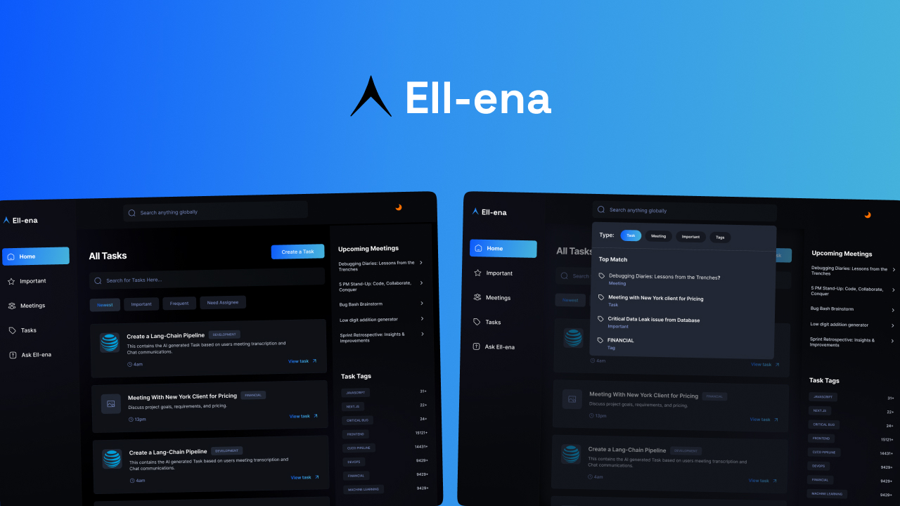
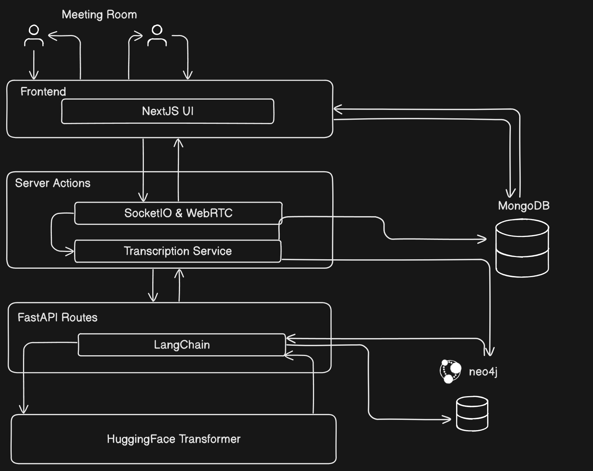

<div align="center">
  <span>
    
  </span>
  <br><br>

# Ell-ena
</div>

Ell-ena is an AI-powered productivity platform that integrates conversational understanding, meeting summarization, and intelligent task generation. It offers seamless interaction with users across tasks, projects, and communication tools—making it easier than ever to stay aligned, accountable, and productive in your team or personal workspace.

## 💻 Technologies Used

- Next.js
- FastAPI
- LangChain
- HuggingFace
- Neo4j
- MongoDB

## Key Features

1.  **Task & Ticket Automation**

*   Generate tasks from meeting you attend (text and voice).

2.  **Meeting Transcription**

*   Transcription of meeting audio.
*   Generation of summarized notes and actionables.

3.  **Chat-Based Interface**

*   Chat interface makes interacting with Ell-ena natural and friendly.
*   It is context aware across sessions to deliver personalized task management.

4.  **Graph RAG Integration**

*   Implements Graph Retrieval Augmented Generation for context retrieval.

## System Architecture Overview
<div align="center">
  <span>
    
  </span>
  <br><br>
</div>

## ▶️ How to Run the Ell-ena App

To get started with Ell-ena, follow these simple steps:

### 🔧 Prerequisites

- Install [Node.js & npm](https://nodejs.org/)
- Install [Python 3.10+](https://www.python.org/downloads/)
- Have a working MongoDB instance (local or [MongoDB Atlas](https://www.mongodb.com/cloud/atlas))
- Get [Clerk](https://clerk.dev) API keys for authentication


### 🛠 Setup Instructions

1. Clone the repository:
   ```bash
   git clone https://github.com/khushal1512/ell-ena.git
   ```
   ```bash
   cd ell-ena
   ```
   ```bash
   npm install
   ```

2. Create a ```.env``` file in the root and add the following: 
   ```env
   MONGODB_URL=<your_mongodb_url>
   CLERK_API_KEY=<your_clerk_api_key>
   ```
3. Run the development server
   ```bash
   npm run dev
   ```


Open [http://localhost:3000](http://localhost:3000) with your browser to see the result.

